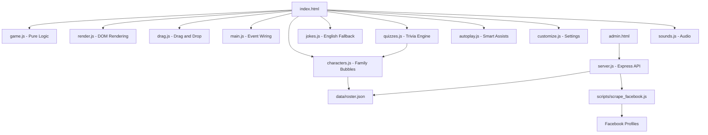
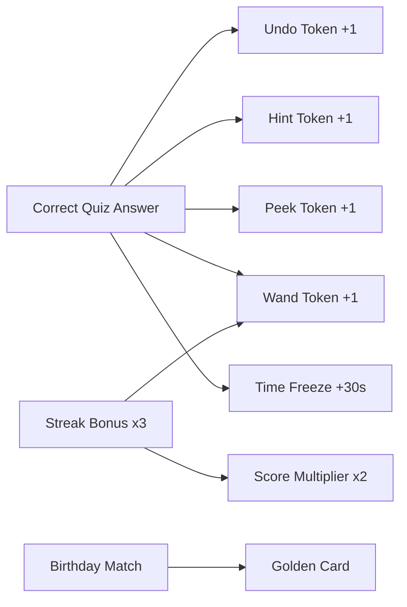
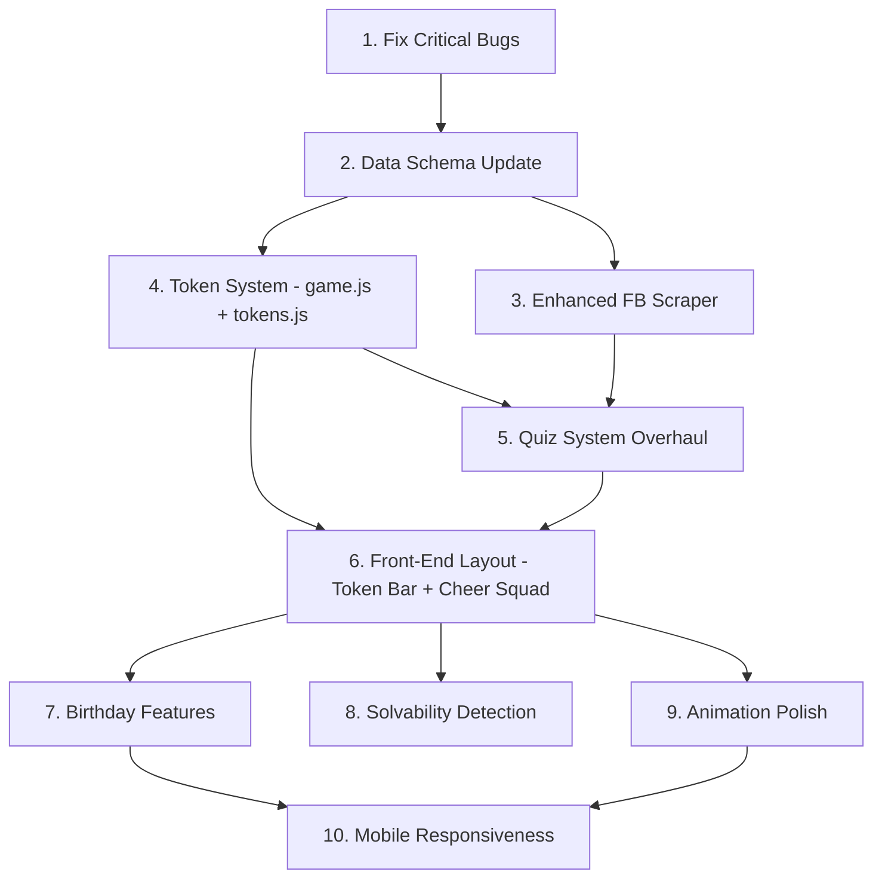

# Mom's Solitaire -- 20x Better Gamification Plan

## Current State Summary

The app is a **vanilla JS/CSS/HTML Klondike Solitaire** game personalized for Mom. It already has:
- Family character speech bubbles triggered by game events (Portuguese messages)
- A Facebook scraper (Playwright) that extracts profile photos and birth dates
- A basic quiz system that rewards one auto-move for correct answers
- 4 personality presets: funny, sweet, coach, wise
- Admin panel for managing characters
- Customizable card backs, sounds, and themes
- Auto-complete and hint systems

### Known Bugs
- **Duplicate HTML in `index.html`**: Lines 26-40 duplicate the entire `<head>` and opening `<body>` tags inside the header, causing malformed HTML that browsers silently fix but could break rendering.

---

## Architecture Overview



---

## Plan: 7 Work Streams

### Stream 1: Fix Critical Bugs

- [ ] **Fix duplicate HTML in `index.html`** -- Remove the duplicated `<!DOCTYPE>`, `<head>`, and `<body>` tags at lines 26-40 that are nested inside the header
- [ ] **Fix roster.json character messages format** -- Messages in roster.json are stored as strings but `characters.js` `getCharacterMessage()` expects arrays. The scraper outputs arrays correctly but the current roster has strings. Normalize to arrays everywhere.

---

### Stream 2: Enhanced Facebook Scraping

The current scraper only extracts **profile photo** and **birth date/year**. Expand it to gather richer data for quiz generation.

#### New Data Points to Scrape
- [ ] **Hometown / Current City** -- from the About page "Places Lived" section
- [ ] **Workplace** -- from the About "Work and Education" section  
- [ ] **Education** -- school/university names
- [ ] **Relationship status** -- if public
- [ ] **Profile bio / intro text** -- the short intro line on the profile

#### Scraper Improvements
- [ ] **Add retry logic** with exponential backoff for failed profile loads
- [ ] **Extract cover photo** as an alternative avatar source
- [ ] **Scrape the "Life Events" section** for wedding dates, graduation dates, etc.
- [ ] **Generate richer quizzes** from all scraped data points -- not just birthdays

#### Updated Quiz Generation from Scraper

For each data point scraped, auto-generate quiz questions:

| Data Point | Example Question |
|---|---|
| Birthday | Quando eh o aniversario de Raimundo? |
| Birth Year | Em que ano Raimundo nasceu? |
| Hometown | De onde eh Raimundo? |
| Workplace | Onde Raimundo trabalha? |
| Education | Onde Raimundo estudou? |
| Life Event | Em que ano Raimundo se casou? |

---

### Stream 3: Gamification -- Reward Token System

This is the heart of the "20x better" upgrade. Replace the single "free move" reward with a rich **token economy**.

#### Token Types



| Token | What It Does | How to Earn |
|---|---|---|
| **Undo Token** | Free undo without score penalty | Correct quiz answer |
| **Hint Token** | Free hint highlight | Correct quiz answer |
| **Peek Token** | Peek at any face-down card for 2 seconds | 2 correct answers in a row |
| **Magic Wand** | Auto-plays the best possible move | 3 correct answers in a row, streak bonus |
| **Time Freeze** | Pauses the timer for 30 seconds | Correct answer on hard question |
| **Score Multiplier** | 2x points for next 5 foundation moves | 3-answer streak |

#### New Game State Fields in `G`

```javascript
// Add to createInitialState in game.js
tokens: {
    undo: 0,
    hint: 0, 
    peek: 0,
    wand: 0,
    timeFreeze: 0,
    multiplier: 1,
    multiplierMoves: 0
},
quizStreak: 0,
quizzesAnswered: 0,
quizzesCorrect: 0,
```

#### New File: `js/tokens.js`
- [ ] Create token management module -- `grantToken()`, `useToken()`, `getTokenCount()`
- [ ] Token persistence in game save state
- [ ] Token animation when earned -- floating icon rises from quiz modal
- [ ] Token animation when used -- icon flies to the action it powers

---

### Stream 4: Quiz System Overhaul

The current quiz system in `quizzes.js` is functional but basic. Upgrade it significantly.

#### Quiz Categories
- [ ] **Birthday quizzes** -- already exists, keep
- [ ] **Photo identification** -- "Whose photo is this?" showing a cropped/blurred family avatar
- [ ] **Relationship mapping** -- "Who is Raimundo's sister-in-law?" using relation data
- [ ] **Fun facts** -- manually curated questions about family stories
- [ ] **Memory lane** -- "What year did the family go to X?" from life events

#### Quiz Difficulty Tiers

| Tier | Reward | Trigger |
|---|---|---|
| Easy -- multiple choice, 3 options | 1 Undo or Hint token | Player clicks quiz button |
| Medium -- multiple choice, 4 options | 1 Peek or Wand token | Every 15 foundation cards placed |
| Hard -- free text input | Time Freeze + Score Multiplier | Every completed suit |

#### Quiz UX Improvements
- [ ] **Animated quiz entrance** -- character slides in from side with speech bubble
- [ ] **Timer on quiz** -- 15 seconds to answer, adds urgency
- [ ] **"Phone a Family Member"** lifeline -- eliminates one wrong answer, costs 1 Hint token
- [ ] **Quiz cooldown** -- prevent spamming the quiz button, 60-second cooldown between voluntary quizzes
- [ ] **Quiz history** -- track which questions were asked so they do not repeat in the same session
- [ ] **Celebration animation** on correct answer -- character does a happy dance or confetti burst
- [ ] **Wrong answer teaching moment** -- show the correct answer with a fun fact

#### Automatic Quiz Triggers

Instead of only manual quiz button clicks, quizzes should appear organically:

- [ ] **When stuck** -- after 30 seconds with no moves, character pops up: "Need help? Answer this and I will give you a hint!"
- [ ] **Milestone quizzes** -- at 25%, 50%, 75% progress, a family member appears with a bonus quiz
- [ ] **Birthday greeting interrupt** -- if today matches a family member's scraped birthday, special celebration quiz appears at game start

---

### Stream 5: Solvability Detection and Smart Assistance

#### Solvability Analysis
- [ ] **Dead-end detection** -- after each move, check if there are any valid moves remaining. If not, show a "stuck" UI with options: use a Wand token, undo, or start new game
- [ ] **Stock exhaustion warning** -- when the stock has been cycled through 3 times with no moves made from waste, warn the player
- [ ] **Smart hint upgrade** -- current `findHint()` only looks one move ahead. Upgrade to evaluate 2-3 moves ahead for better suggestions
- [ ] **"Mercy mode"** -- when no valid moves exist and player has no tokens, offer a free quiz as a lifeline

#### Auto-Complete Improvements
- [ ] **Progressive auto-complete** -- instead of requiring ALL cards face-up, allow partial auto-complete when foundations can be built from visible cards only
- [ ] **Auto-complete animation polish** -- cards fly to foundations in an arc with trail effects

---

### Stream 6: Front-End Layout and UX Overhaul

#### Fix Structural Issues
- [ ] **Remove duplicate HTML** in `index.html`
- [ ] **Add proper meta tags** for PWA support -- `manifest.json`, service worker for offline play

#### New UI Components

##### Token Inventory Bar
A persistent bar showing earned tokens, placed below the header:

```
+-----------------------------------------------------+
| Undo: 2  |  Hint: 1  |  Peek: 0  |  Wand: 1  |  x2 |
+-----------------------------------------------------+
```

- [ ] Create `token-bar` HTML section in `index.html`
- [ ] Style with pill badges, animated count changes
- [ ] Tokens glow when available, gray when empty
- [ ] Click a token to activate it -- undo token click triggers undo, etc.

##### Family Cheer Squad
A horizontal strip of family member avatars at the bottom of the screen:

```
+-----------------------------------------------------+
|  [Photo1]  [Photo2]  [Photo3]  [Photo4]  [Photo5]   |
|  Brother   Cunhada   Sobrinha   Self     Sobrinha    |
+-----------------------------------------------------+
```

- [ ] Show all registered family members as circular avatars
- [ ] Active speaker gets a pulsing border
- [ ] Click an avatar to see their stats -- quizzes about them, messages sent
- [ ] Birthday crown icon on members whose birthday is today
- [ ] Hover shows a tooltip with their relation and a random message

##### Quiz Streak Counter
- [ ] Visual streak counter near the quiz button: flame icon with number
- [ ] Streak counter pulses and grows with consecutive correct answers
- [ ] Streak breaks with wrong answer -- sad animation

##### Improved Victory Screen
- [ ] Show quiz stats: "You answered 5/7 family trivia questions correctly!"
- [ ] Show tokens earned and used
- [ ] Family members line up and each says a congratulations message in sequence
- [ ] "Share" concept -- generate a screenshot-friendly stats card

##### Birthday Celebration Mode
- [ ] On game boot, check if today matches any family member's scraped birthday
- [ ] If match found, show a special greeting modal with their photo, a birthday message, and a bonus quiz
- [ ] Birthday confetti theme for the entire session
- [ ] Birthday member gets special golden speech bubbles all game

#### Mobile Responsiveness
- [ ] Improve card sizing on small screens
- [ ] Touch-friendly token bar
- [ ] Swipe gestures for stock drawing
- [ ] Bottom sheet quiz modal on mobile instead of centered overlay

#### Animation Upgrades
- [ ] **Card deal animation** -- cards fly from deck to tableau positions on new game
- [ ] **Foundation completion fireworks** -- per-suit celebration when A through K is complete
- [ ] **Token earn animation** -- token icon floats up from quiz modal to the token bar
- [ ] **Character entrance animation** -- family members slide in from the sides for speech bubbles

---

### Stream 7: Data Flow and Architecture Improvements

#### Roster Schema Update

Expand the character schema to support richer data:

```javascript
{
    id: "uuid",
    name: "Raimundo",
    relation: "Brother",
    avatar: "base64...",
    color: "#c9a55a",
    personality: "sweet",
    // NEW FIELDS:
    birthday: "14 de maio",     // extracted from FB
    birthYear: "1975",          // extracted from FB
    hometown: "Belem",          // extracted from FB
    workplace: "Company X",     // extracted from FB
    education: "University Y",  // extracted from FB
    funFacts: [],               // manually added fun facts
    quizzes: [                  // auto-generated + manual
        { question: "...", answer: "...", difficulty: "easy", category: "birthday" }
    ],
    messages: { /* arrays, not strings */ },
    activeEvents: [],
    stats: {                    // NEW: per-character game stats
        quizzesAsked: 0,
        quizzesCorrect: 0,
        timesAppeared: 0
    }
}
```

#### Separate Quiz Bank
- [ ] Create `data/quizzes.json` -- a dedicated quiz bank separate from roster, allowing manual quiz curation
- [ ] Quiz bank merges auto-generated quizzes from scraper with manually added ones
- [ ] Admin panel gets a "Quiz Editor" tab for adding/editing questions

#### Game Statistics
- [ ] Track session history in localStorage: games played, win rate, average time, quiz accuracy
- [ ] Add a "Stats" modal accessible from the header
- [ ] Track per-character interaction stats

#### Server API Additions
- [ ] `GET /api/quizzes` -- fetch the dedicated quiz bank
- [ ] `POST /api/quizzes` -- save quiz bank updates
- [ ] `GET /api/stats` -- fetch game statistics (optional, could stay client-side)

---

## Implementation Order

The work should proceed in this order to minimize dependencies:



### Detailed Task Order

1. **Fix `index.html` duplicate HTML bug** -- quick win, prevents rendering issues
2. **Normalize roster.json messages to arrays** -- data consistency
3. **Update roster schema** -- add new fields to data model
4. **Update scraper to extract new data points** -- hometown, workplace, education, life events
5. **Create `js/tokens.js`** -- token economy logic module
6. **Add token state to `G` in `game.js`** -- extend game state
7. **Build token inventory bar UI** -- HTML + CSS in index.html and style.css
8. **Overhaul `js/quizzes.js`** -- difficulty tiers, categories, timer, cooldown, history
9. **Wire tokens to quiz rewards** -- correct answer grants tokens based on difficulty
10. **Wire tokens to game actions** -- peek, wand, time freeze functionality
11. **Add automatic quiz triggers** -- stuck detection, milestone quizzes
12. **Build family cheer squad UI** -- avatar strip at bottom
13. **Build birthday detection and celebration** -- date matching, special greetings
14. **Improve solvability detection** -- dead-end detection, mercy mode
15. **Add quiz streak counter UI** -- flame icon with animations
16. **Upgrade victory screen** -- quiz stats, family congratulations sequence
17. **Animation polish pass** -- deal animation, token animations, character entrances
18. **Create quiz editor in admin panel** -- manual quiz curation
19. **Create stats modal** -- game history, quiz accuracy
20. **Mobile responsiveness pass** -- touch-friendly tokens, responsive card sizing

---

## Files Changed Summary

| File | Changes |
|---|---|
| `index.html` | Fix duplicate HTML, add token bar, cheer squad strip, streak counter, stats modal |
| `js/game.js` | Add token state fields, multiplier logic to scoring |
| `js/tokens.js` | **NEW** -- Token economy management |
| `js/quizzes.js` | Major overhaul -- categories, difficulty, timer, cooldown, auto-triggers |
| `js/characters.js` | Birthday detection, richer message selection, per-character stats |
| `js/render.js` | Render token bar, cheer squad, streak counter |
| `js/autoplay.js` | Smart hint upgrade, progressive auto-complete, wand token integration |
| `js/main.js` | Wire new events, birthday check on boot, stuck detection timer |
| `js/jokes.js` | Add quiz-related joke categories |
| `scripts/scrape_facebook.js` | Extract hometown, workplace, education, life events, generate richer quizzes |
| `data/roster.json` | Schema update with new fields |
| `data/quizzes.json` | **NEW** -- Dedicated quiz bank |
| `server.js` | Add quiz API endpoints |
| `admin.html` | Quiz editor tab |
| `css/style.css` | Token bar, cheer squad, streak counter, birthday theme styles |
| `css/animations.css` | Token animations, deal animation, character entrance animations |
| `css/modal.css` | Quiz timer, improved trivia overlay, stats modal |
